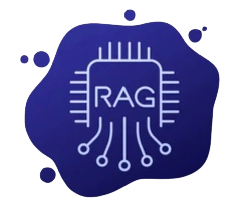
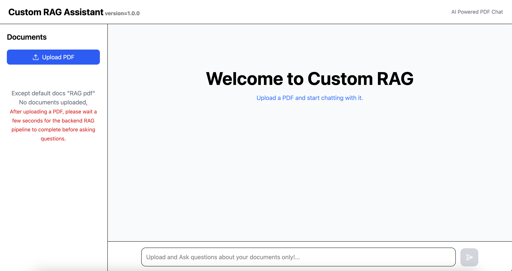

# 📚 Custom RAG (Retrieval-Augmented Generation)

<p align="center">
  
</p>

<h3 align="center">
Production-Ready Retrieval-Augmented Generation System using FastAPI, React, LangChain, ChromaDB, Hugging Face Embeddings, and Groq LLM.
</h3>

<p align="center">


</p>

---

# 🌟 Overview

Custom RAG is a full-stack Retrieval-Augmented Generation (RAG) application that enables users to upload PDF documents and interact with them using natural language.

Unlike traditional chatbots that rely solely on the Large Language Model's internal knowledge, this application grounds every response in the uploaded documents. Relevant document chunks are retrieved from a vector database and supplied as context to the LLM before generating an answer.

This significantly reduces hallucinations and ensures that responses remain faithful to the source material.

The project follows a clean, modular architecture inspired by production-grade software engineering principles, where every module has a single responsibility and can evolve independently.

---

# 🎯 Why This Project?

Large Language Models are powerful but have two major limitations:

- They hallucinate.
- They do not know your private documents.

Retrieval-Augmented Generation solves both problems by introducing a retrieval layer between the user query and the LLM.

Instead of asking the model to "remember everything," the application:

1. Retrieves the most relevant information.
2. Injects it into the prompt.
3. Generates a grounded answer.

This project demonstrates how modern AI applications are built in production environments.

---

# ✨ Features

## 📄 PDF Upload

- Upload custom PDF documents
- Supports multiple PDFs
- Automatic document processing
- Stores uploaded documents locally

---

## ✂️ Intelligent Chunking

Uses LangChain's RecursiveCharacterTextSplitter.

Configuration:

- Chunk Size: **1000**
- Chunk Overlap: **200**

This preserves context while maximizing retrieval accuracy.

---

## 🧠 Semantic Embeddings

Uses

> **BAAI/bge-small-en-v1.5**

Advantages

- Lightweight
- CPU Friendly
- Excellent semantic similarity
- Production-ready
- Fast inference

Embeddings are normalized before storage for improved cosine similarity performance.

---

## 🗄 Persistent Vector Database

Uses

**ChromaDB**

The database stores

- Vector embeddings
- Metadata
- Original source filename
- Page number

The database persists on disk, eliminating the need to regenerate embeddings every time the application restarts.

---

## 🔍 Semantic Search

Instead of keyword matching, the system performs vector similarity search.

Current retrieval configuration:

- Top K = **4**

This retrieves the four most relevant chunks for every question.

---

## 🤖 Grounded LLM Responses

LLM Provider

**Groq**

Model

**Llama 3.3 70B Versatile**

Temperature

```
0
```

The model never answers from its own knowledge.

Instead, it only receives the retrieved document chunks as context.

---

## 🚫 Hallucination Prevention

A custom system prompt ensures strict grounding.

If the answer cannot be found inside the uploaded documents, the assistant replies:

> Sorry, I couldn't find the answer in the uploaded document.
> Vishal who built me has strictly grounded me.

This prevents fabricated information.

---

## ⚡ Fast Backend

Built using

- FastAPI
- REST APIs
- Modular routing
- Typed request validation
- Pydantic models

---

## 🎨 Interactive Frontend

Built using

- React
- Vite
- Component-based architecture

Features include

- Upload PDFs
- Chat Interface
- Message History
- Source Attribution
- Responsive Layout

---

# 🚀 Tech Stack

## Backend

- Python
- FastAPI
- LangChain
- ChromaDB
- Hugging Face
- Groq
- Pydantic
- Uvicorn

---

## Frontend

- React
- Vite
- JavaScript
- CSS

---

## AI Stack

### Embedding Model

BAAI/bge-small-en-v1.5

Configuration

```python
embedding_model = HuggingFaceEmbeddings(
    model_name="BAAI/bge-small-en-v1.5",
    model_kwargs={
        "device": "cpu"
    },
    encode_kwargs={
        "normalize_embeddings": True
    }
)
```

---

### LLM

Groq

Model

```
llama-3.3-70b-versatile
```

Temperature

```
0
```

---

### Vector Database

ChromaDB

Persistent Storage

Similarity Search

Metadata Filtering

---

### Retrieval

Top K Retrieval

```
k = 4
```

---

### Chunking Strategy

Chunk Size

```
1000
```

Chunk Overlap

```
200
```

---

# Application Preview

<p align="center">
  
</p>

```
Home Page

Upload PDF

Chat Interface

Retrieved Sources

Responsive Mobile View
```

---

# ⭐ Highlights

✔ Production-Ready Architecture

✔ Retrieval-Augmented Generation (RAG)

✔ Semantic Search

✔ Persistent Vector Database

✔ Grounded LLM Responses

✔ Modular Backend

✔ Clean React Frontend

✔ Scalable Folder Structure

✔ RESTful APIs

✔ CPU Optimized Embeddings

✔ Single Responsibility Principle

✔ Separation of Concerns

---

# 🚀 Getting Started

Follow these steps to run the project locally.

---

# Prerequisites

Make sure you have the following installed:

- Python 3.12+
- Node.js 20+
- Git
- pip
- npm

---

# 1. Clone the Repository

```bash
git clone https://github.com/PixelCraftLab/custom-RAG.git
```

Move into the project directory.

```bash
cd custom-RAG
```

---

# 2. Backend Setup

Move to the backend folder.

```bash
cd backend
```

Create a virtual environment.

### Windows

```bash
python -m venv venv
```

Activate it.

```bash
venv\Scripts\activate
```

### macOS / Linux

```bash
python3 -m venv venv
```

Activate it.

```bash
source venv/bin/activate
```

Install the required dependencies.

```bash
pip install -r requirements.txt
```

---

# 3. Environment Variables

Create a `.env` file inside the **backend** directory.

Example:

```env
GROQ_API_KEY=your_groq_api_key
```

You can obtain a free API key from:

https://console.groq.com/keys

---

# 4. Start the Backend

Run the FastAPI server.

```bash
uvicorn main:app --reload
```

Backend will start on

```
http://127.0.0.1:8000
```

Swagger Documentation

```
http://127.0.0.1:8000/docs
```

---

# 5. Frontend Setup

Open another terminal.

Move to the frontend folder.

```bash
cd frontend
```

Install dependencies.

```bash
npm install
```

Start the development server.

```bash
npm run dev
```

Frontend runs at

```
http://localhost:5173
```

---

# 6. Upload a Document

Open the application in your browser.

Upload one or more PDF documents.

The backend will:

- Read the PDF
- Split it into chunks
- Generate embeddings
- Store embeddings inside ChromaDB

---

# 7. Ask Questions

After ingestion completes, ask questions related to the uploaded document.

Example:

```
What is Retrieval-Augmented Generation?

Summarize Chapter 3.

What are the key findings?

List the important points.
```

The application retrieves the most relevant chunks before sending them to the LLM.

---

# Project Structure

```
custom-RAG
│
├── backend
│
└── frontend
```

Run these simultaneously.

Backend

```
uvicorn main:app --reload
```

Frontend

```
npm run dev
```

---

# Default URLs

Frontend

```
http://localhost:5173
```

Backend

```
http://127.0.0.1:8000
```

API Documentation

```
http://127.0.0.1:8000/docs
```

---

# Troubleshooting

### Backend doesn't start

Ensure the virtual environment is activated.

```bash
source venv/bin/activate
```

or

```bash
venv\Scripts\activate
```

---

### Missing dependencies

Reinstall them.

```bash
pip install -r requirements.txt
```

---

### Frontend won't start

Install Node packages.

```bash
npm install
```

---

### ChromaDB issues

Delete the existing database and regenerate embeddings.

```bash
rm -rf db
```

or (Windows)

```cmd
rmdir /s db
```

Then upload the document again.

---

# Tech Stack

### Frontend

- React
- Vite
- JavaScript
- CSS

### Backend

- FastAPI
- LangChain
- ChromaDB

### AI Stack

- BAAI/bge-small-en-v1.5 (Embeddings)
- Groq API
- Llama 3.3 70B Versatile

### Vector Database

- ChromaDB

### Language

- Python

### Package Manager

- pip
- npm

# 🏗️ System Architecture

```
                           +----------------------+
                           |      React UI        |
                           |  (Vite Frontend)     |
                           +----------+-----------+
                                      |
                                      |
                             REST API Calls
                                      |
                                      ▼
                        +---------------------------+
                        |        FastAPI            |
                        |     Backend Server        |
                        +------------+--------------+
                                     |
             +-----------------------+------------------------+
             |                       |                        |
             ▼                       ▼                        ▼
     Upload API               Chat API               Document API
             |                       |                        |
             ▼                       ▼                        ▼
     PDF Processing         Semantic Retrieval        Document Management
             |                       |
             ▼                       ▼
      Document Loader         Chroma Vector Store
             |                       |
             ▼                       ▼
      Text Chunking          Similarity Search
             |                       |
             +-----------+-----------+
                         |
                         ▼
                Retrieved Chunks
                         |
                         ▼
                 Prompt Construction
                         |
                         ▼
                 Groq Llama 3.3 70B
                         |
                         ▼
                  Final Response
                         |
                         ▼
                    React Frontend
```

---

# 🧠 RAG Workflow

The application follows a complete Retrieval-Augmented Generation (RAG) pipeline.

Instead of directly asking the Large Language Model to answer a question, the application first retrieves relevant information from the uploaded documents and then supplies that information as context.

This grounding step greatly improves factual accuracy while minimizing hallucinations.

---

## Step 1 — Upload Document

The user uploads one or more PDF documents through the React interface.

```
React
   │
   ▼
FastAPI Upload Endpoint
```

The backend receives the PDF and stores it inside:

```
backend/data/uploads/
```

---

## Step 2 — Load Documents

LangChain's PDF loader reads every page.

Each page becomes a LangChain `Document` object.

Example

```
Document
│
├── page_content
└── metadata
     ├── source
     └── page
```

Metadata is preserved throughout the pipeline for source attribution.

---

## Step 3 — Chunking

Large Language Models cannot efficiently process entire PDFs.

Instead, each document is divided into smaller overlapping chunks.

Configuration

```python
chunk_size = 1000

chunk_overlap = 200
```

Example

```
Document

Page 1
-----------------------------------------------------

Chunk 1

Lorem ipsum...

-------------------------

Chunk 2

(previous 200 characters)

-------------------------

Chunk 3

(previous overlap)

...
```

### Why overlap?

Without overlap

```
Chunk 1

The capital of France

Chunk 2

is Paris
```

The meaning is lost.

With overlap

```
Chunk 1

The capital of France

Chunk 2

France is Paris
```

Context is preserved.

---

# Step 4 — Embedding Generation

Each chunk is converted into a dense numerical vector.

Embedding Model

```
BAAI/bge-small-en-v1.5
```

Configuration

```python
HuggingFaceEmbeddings(

    model_name="BAAI/bge-small-en-v1.5",

    model_kwargs={
        "device":"cpu"
    },

    encode_kwargs={
        "normalize_embeddings":True
    }

)
```

The embedding captures semantic meaning rather than simple keywords.

For example

```
"Artificial Intelligence"

and

"Machine Learning"

will have nearby vectors even though they are different words.

```

---

# Step 5 — Vector Storage

Generated vectors are stored inside ChromaDB.

```
backend/db/
```

The database contains

```
Embedding

↓

Original Text

↓

Metadata

↓

Source Filename

↓

Page Number
```

Since ChromaDB is persistent, embeddings only need to be generated once.

---

# Step 6 — User Question

Example

```
What is Retrieval-Augmented Generation?
```

The question is embedded using the same embedding model.

```
Question

↓

Embedding Vector
```

---

# Step 7 — Similarity Search

The question embedding is compared against every stored vector.

The closest vectors are retrieved.

Current configuration

```python
k = 4
```

Result

```
Question

↓

Vector Search

↓

Top 4 Chunks
```

Only these chunks continue through the pipeline.

---

# Step 8 — Prompt Engineering

The retrieved chunks are injected into the prompt.

Example

```
SYSTEM

You are a helpful AI assistant.

Answer ONLY using the provided context.

-----------------------

Context

Chunk 1

Chunk 2

Chunk 3

Chunk 4

-----------------------

Question

What is RAG?

----------------------- 

Answer
```

The model never receives the entire PDF.

Only the most relevant context.

---

# Step 9 — LLM Generation

The application uses

```
Groq

↓

Llama 3.3 70B Versatile
```

Configuration

```python
temperature = 0
```

This makes responses deterministic and reduces randomness.

---

# Step 10 — Response

The backend returns

```json
{
    "answer": "...",
    "sources": [
        {
            "source":"paper.pdf",
            "page":4
        }
    ]
}
```

The frontend displays

```
Answer

↓

Source

↓

Page Number
```

---

# End-to-End Pipeline

```
User Uploads PDF
        │
        ▼
Load PDF
        │
        ▼
Split into Chunks
        │
        ▼
Generate Embeddings
        │
        ▼
Store in ChromaDB
        │
        ▼
────────────────────────────
        │
User asks Question
        │
        ▼
Embed Question
        │
        ▼
Similarity Search
        │
        ▼
Top 4 Chunks
        │
        ▼
Prompt Construction
        │
        ▼
Groq Llama 3.3 70B
        │
        ▼
Answer
        │
        ▼
React UI
```

---

# 📦 Data Flow

```
PDF

↓

Document Loader

↓

LangChain Document

↓

RecursiveCharacterTextSplitter

↓

Chunks

↓

Embedding Model

↓

Vectors

↓

ChromaDB

↓

Retriever

↓

Prompt

↓

Groq LLM

↓

Response

↓

Frontend
```

---

# 🎯 Why This Architecture?

This architecture is designed around production software engineering principles.

### Separation of Concerns

Each module performs exactly one task.

Examples

- Loader → Reads documents
- Splitter → Creates chunks
- Embeddings → Generates vectors
- Retriever → Searches vectors
- Prompt → Builds prompts
- LLM → Generates answers         
- API → Handles HTTP requests

This follows the **Single Responsibility Principle (SRP)**, making the codebase easier to test, maintain, and extend.

---

# 🚀 Benefits of the Architecture

- Modular and maintainable
- Easily replaceable components (swap LLMs or vector databases)
- Persistent storage avoids repeated embedding generation
- Efficient semantic retrieval
- Low hallucination through grounded prompting
- Clean API boundaries
- Ready for cloud deployment
- Easy to scale into a multi-user RAG system

---